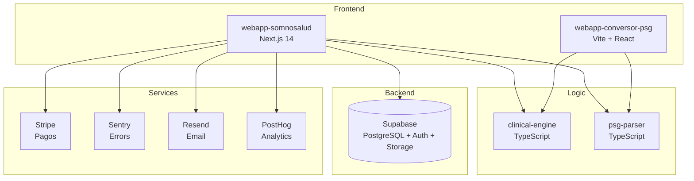

# Arquitectura SomnoSalud Platform

## Diagrama de alto nivel

## Principios

1. **Logic separada de UI** — `clinical-engine` y `psg-parser` no dependen de framework visual.
2. **TypeScript estricto** en todo el monorepo.
3. **Compliance médico desde día 1** — disclaimer + T&C + consentimiento auditable.
4. **Tests obligatorios** para todo módulo del clinical-engine antes de merge.
5. **Referencias científicas verificables** (DOI/PMID) para cada recomendación clínica.
