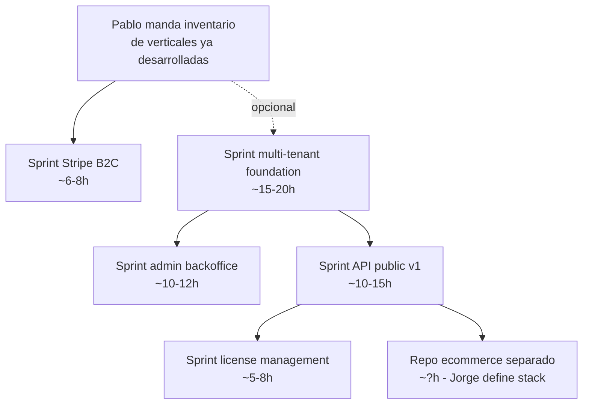

# Product Roadmap — Brief Jorge 2026-05-18

> [!info] Origen
> Brief de Jorge enviado por WhatsApp el 2026-05-18 21:42-22:04 AR. Pasado a Cowork el 2026-05-24 por Fabio para captura + planificación.

## Brief textual (quotes verbatim)

> **[9:42 PM 18/5/2026] Jorge:** Mandar para la SAAS de Somnosalud B2C las demás verticales para que Fabio pueda codear todo en una misma APP. Esto se monetiza en B2C con un modelo de suscripción Mensual por USD …….. y si se suscriben anual tienen un %???? de descuento. Esperamos info de Pablo de lo que él ya desarrolló que nos falta para completar el ecosistema de Somnosalud SAAS.

> **[9:44 PM 18/5/2026] Jorge:** En el caso de B2B la idea es contar con Api keys de todo o partes en caso de que una entidad (obra social, hospital, clínica, etc) quiera un acceso parcial y debe tener la posibilidad de comercializarlo como White Label para que cada lugar lo ofrezca como propio. Desarrollar Backend y Backoffice para tal fin. En el caso de B2B la contratación no es por suscripción sino por Licencia de uso por tiempo determinado en el contrato con cada cobertura medica y o entidad que nos contrate.

> **[9:47 PM 18/5/2026] Jorge:** Desarrollar un Ecommerce para poder vender todas las cosas satelitales a la SAAS (aparatos, máscaras, pastillas, etc). Este ecommerce no será parte de la SAAS, pero si uno es usuario de la SAAS, tendrá un beneficio de descuento en el sitio.

> **[10:04 PM 18/5/2026] Jorge:** Cuando lo vea a Pablo esta semana, debo chequear la configuración de su Operating System de Claude y debo configurarle algún Skill con TTS para que él pueda hablar libremente con Claude en vez de escribir todo. Alguna herramienta tipo Whisper, ElevenLabs o similar.

---

## Interpretación + decomposición

### Eje 1 — SaaS B2C (consolidación + monetización)

**Visión:** una sola app Next.js que cubre **todas las verticales** que Pablo desarrolle. Monetización por suscripción.

| Item | Estado actual | Gap |
|------|---------------|-----|
| App única con todas las verticales | ✅ webapp-somnosalud existe. Hoy = 1 vertical (evaluación 12 pasos). Arquitectura permite agregar más sin fragmentar. | Esperar inventario de Pablo. Cuando llegue → Sprint(s) integración por vertical. |
| Suscripción mensual USD | ❌ Stripe NO instalado. CLAUDE.md lo lista Fase 3, pero el brief lo adelanta a Fase 2. | Sprint Stripe-integration (~6-8 h): `subscriptions` table + Customer/Subscription Stripe API + webhooks → middleware paywall + `pricing` page. |
| Descuento anual | ❌ idem Stripe. | Decisión de packaging: precio mensual vs anual (% descuento) → variable de entorno o tabla `plans`. **Falta input Jorge.** |

**Bloqueante:** ningún sprint Stripe arranca hasta que Jorge defina precios (mensual / anual / %) + Pablo mande inventario de verticales (puede impactar packaging — ej. plan básico vs premium con módulos extra).

### Eje 2 — B2B White Label + API Keys

**Visión:** vender acceso parcial/total como SDK + permitir que cada cliente B2B (obras sociales, hospitales, clínicas) renderice la plataforma con su propia marca. Modelo licencia por tiempo.

| Item | Estado actual | Gap |
|------|---------------|-----|
| API Keys con scopes parciales | ❌ Cero API REST pública. Server Actions solo consumibles desde el propio frontend Next. | Sprint API-public-v1 (~10-15 h): Route Handlers `/api/v1/*` + tabla `api_keys` con scopes JSON + middleware Bearer auth + rate limiting (upstash redis o equivalente) + audit dedicado en `audit_log`. |
| White Label (branding override por tenant) | ❌ Schema actual es single-tenant. Sin `clinic_id` column. Sin theming dinámico. | Sprint multi-tenant-foundation (~15-20 h): migration agrega `clinic_id` a `profiles` + `evaluations` + `audit_log` + nuevas RLS policies + tabla `clinics` con branding (logo URL, colores, dominio custom) + middleware subdomain routing (`ifn.somnosalud.com` → carga clinic_id correcto). |
| Backoffice gestión clinics | ❌ No existe. | Sprint admin-backoffice (~10-12 h): role-based access en `profiles` (`role: 'admin' | 'user'`) + rutas `/admin/*` protegidas + UI CRUD de clinics + API key generation + visualización de uso. |
| Modelo licencia por tiempo (NO suscripción) | ❌ Diferente de Stripe B2C. | Sprint license-management (~5-8 h): tabla `licenses` con `clinic_id`, `valid_from`, `valid_to`, `included_scopes` + check en API middleware antes de cada request. |

**Dependencia interna:** white-label requiere multi-tenant antes que cualquier otra cosa B2B. Recomendación: secuencia es **multi-tenant → backoffice → API keys → licenses**.

### Eje 3 — E-commerce satelital

**Visión:** **repo separado**, vende productos físicos (CPAPs, máscaras, suplementos). Discount para users SaaS.

| Item | Estado actual | Gap |
|------|---------------|-----|
| Repo e-commerce | ❌ No existe. | Decisión: ¿stack custom (Next.js + Stripe + Shopify) vs Shopify white-label puro vs WooCommerce? **Falta input Jorge.** Recomendación Cowork: Shopify Hydrogen (Next-compatible) para no reinventar carrito + checkout. |
| Discount cross-system | ❌ Requiere que SaaS exponga endpoint público autenticado. | Depende del **Eje 2 API Keys**. El e-commerce hace `GET /api/v1/me/discount-code` con la API key del propio e-commerce + token del user → SaaS responde código de descuento + porcentaje. |

**Decisión arquitectónica:** este sub-producto NO vive en este repo. Cuando arranque, abrimos repo `itsomnosalud/somnosalud-shop` separado. Por ahora solo trackeamos la dependencia con SaaS.

### Eje 4 — Operativo (no afecta este repo)

> Jorge le configura a Pablo Claude Code con un Skill TTS (Whisper / ElevenLabs / similar) para que Pablo hable en vez de escribir.

**Acción:** trabajo de Jorge fuera del scope SomnoSalud repo. Posible que toque CLAUDE.md de Pablo / `.claude/skills/` de su instalación local. **No afecta esta plataforma.**

---

## Dependencias detectadas

---

## Estado y bloqueantes

**Status global:** `pending-pablo-input`.

Sin el inventario de Pablo no podemos:
- Definir packaging B2C (qué módulos en plan básico vs premium).
- Estimar scope de "agregar las demás verticales" (puede ser 1 sprint chico o varios sprints grandes según qué nos mande).
- Saber si las verticales requieren cambios al `clinical-engine` actual o son aditivos.

Sin definir precios + descuento Jorge:
- No podemos arrancar Sprint Stripe (precios van en env vars o tabla `plans` seed).

Acciones recomendadas:
1. **Jorge → Pablo:** pedir inventario antes de la reunión de esta semana.
2. **Jorge → Cowork:** definir packaging tentativo (precio mensual + descuento anual) aunque sea como variable a iterar.
3. **Mientras tanto:** cerrar pendientes chicos ([[../debt/DEBT-resend-smtp-supabase]], Sprint 3 Vercel preview, activar Sentry) para que Pablo vea el sitio funcionando en producción cuando lo visite Jorge.

---

## Sub-roadmap propuesto (orden ejecución, post-input Pablo)

| # | Sprint | Estimación | Dependencia |
|---|--------|------------|-------------|
| 1 | Sprint 3 Vercel preview deploy | ~2 h | nada |
| 2 | Sprint DEBT-resend-smtp-supabase activate | ~2 h | DNS records `somnosalud.com.ar` |
| 3 | Sprint Sentry activation | ~30 min | crear project sentry.io |
| 4 | Sprint integration-verticales-pablo | ~5-15 h | input Pablo |
| 5 | Sprint Stripe B2C | ~6-8 h | decisión precios Jorge |
| 6 | Sprint multi-tenant foundation | ~15-20 h | ninguna técnica |
| 7 | Sprint admin backoffice | ~10-12 h | multi-tenant |
| 8 | Sprint API public v1 | ~10-15 h | multi-tenant |
| 9 | Sprint license management | ~5-8 h | API public v1 |
| 10 | Repo nuevo ecommerce | ~? | decisión stack Jorge |

**Total estimado Fase 2-3 ecosistema completo:** ~55-85 h de desarrollo + asset binarios (logo, theme override por tenant).

---

## Notas para sesiones futuras

- **Multi-tenant en este Sprint vs Fase 3:** CLAUDE.md actual dice "multi-tenant Fase 3". El brief de Jorge lo adelanta. Cuando arranquemos hay que actualizar CLAUDE.md tabla Roadmap.
- **Stripe:** brief dice "B2C mensual + anual descuento". CLAUDE.md decía "Fase 3 B2B freemium". Reinterpretación: Stripe **arranca antes** y para B2C, no B2B. Update CLAUDE.md cuando arranquemos Sprint Stripe.
- **License vs Subscription:** dos modelos distintos coexistiendo. Tabla `subscriptions` (Stripe-managed B2C) + tabla `licenses` (manual contract B2B). NO mezclar — son ciclos de vida y autoridades distintas.
- **API Keys:** considerar formato Stripe-like `sk_live_...` vs Supabase-like `sb_...`. Decisión a tomar al arrancar Sprint API.
- **Audit log existente** ya soporta multi-actor: agregar `api_key_id` como columna nueva en migration para attribución de calls B2B (vs user_id para B2C/UI).
